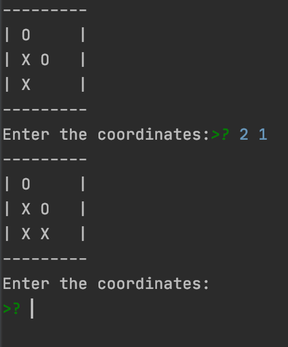

# Tic-Tac-Toe

`X` moves first, `O` second

Input 2 numbers to choose coordinates to put a sign.

Coordinates table:

(1, 3) (2, 3) (3, 3)

(1, 2) (2, 2) (3, 2)

(1, 1) (2, 1) (3, 1)

To put a sign to bottom left cell, write `1 1` on input. Use only two digits for correct input.

